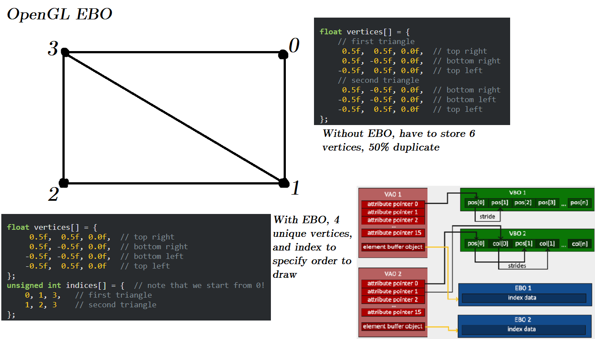
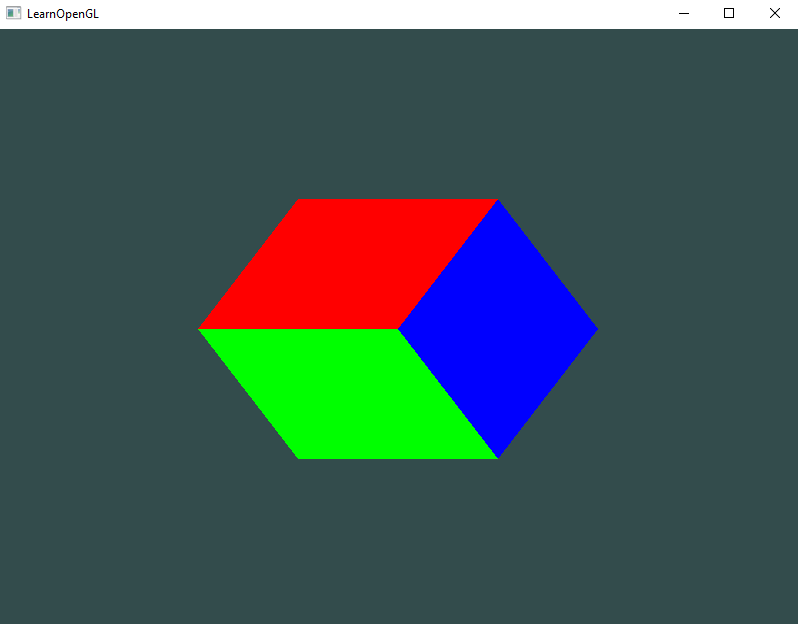
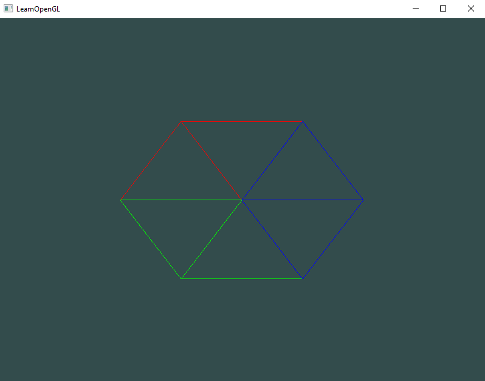
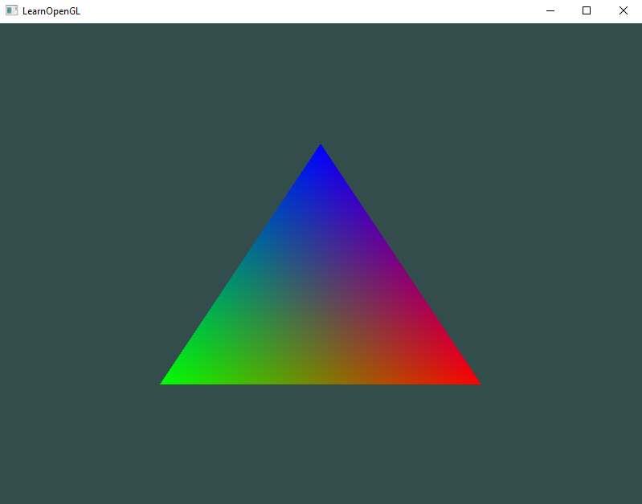
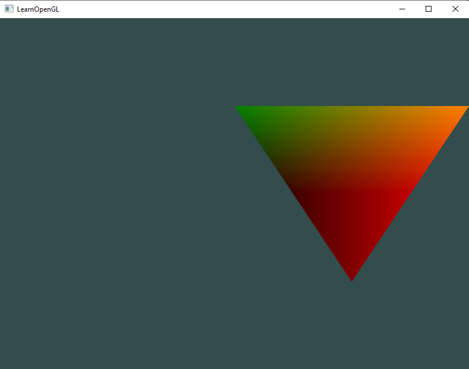

*Coding Project*
# LearnOpenGL
Learning to use OpenGL (and OpenCL) so I can do high performance scientific computing and modelling on the GPU.
Using www.learnopengl.com as my main resource

## Progress update 1 - Hello Triangle - 30/06/24
* I understand how VBOs (vertex buffer objects), VAOs (vertex array objects), and EBOs (element buffer objects) work and why we need them.
* The VAO essentially stores the pointers (memory addresses) for all the vertex attributes (position, color, etc.) in a specific VBO, which stores the actual values of those vertex attributes.
* An EBO fixes the issue of duplicate vertices when they overlap by storing only the unique vertices and an index to render them in the correct order.
* Was able to render a static 3D RGB cube using 3 fragment shaders and 3 VBOs, 3 VAOs, and 3 EBOs.
* I feel like 3 fragment shaders, 3 VBOs, 3 VAOs, and 3 EBOs is overkill just to render 3 different colors for 3 sets of 2 triangles. There's probably a way to have all 6 triangles in one VBO with their color attributes also included.
  This will probably be explained in the next chapters.

## Progress update 2 - Shaders - 20/07/24
* Gave each vertex a color attribute as well as a position attribute, so instead of having 3 VBOs, 3 VAOs, and 3 EBOs, we just have 1 of each and 2 vertex attributes. One for each object makes sense (I assume when we get to rendering 1000s of identical objects we will encounter "instancing").
* Removed the vertex shader and fragment shader GLSL code from the main.cpp file and put them into separate "shader.vert" and "shader.frag" text files (I recommend installing a GLSL syntax highlighter extension).
* Made a shader class and header file that can handle retrieving source code; compiling, linking, deleting, and activating shaders; defining utility functions; and handling errors.
* I understand what uniform variables are (basically global variables that all shaders can access), you need to define them in the main.cpp file and give them to the shader (using utility uniform functions if you have a separate shader header file, or just by giving the uniform location with "glUniform)".
* Switched from OpenGL 3.3 to 4.3 so that I can specify the "layout (location=...)" for uniforms, for some reason in OpenGL 3.3 that didn't work. This is a really nice video that helped me understand the "layout (location=...)" specifier:

* At 21:11 it talks about the specifier and how you can omit the specifier but if you don't then you can change the variable name in the next shader, and vertex attributes and uniforms are stored in different arrays so you can have seemingly two different variables stored in "location=0" but they are actually in different arrays.

* This animation was done by storing a green color uniform variable in the render loop that changes over time, this uniform variable can be accessed by the fragment shader to render the triangle with a changing color.

* This rainbow triangle was done by storing a red, green, and blue color value as a second vertex attribute for each of the 3 vertices. "Fragment interpolation" occurs, where a linear combination of the colors is used for all the fragments (can think of them as pixels) between the 3 vertices.

* This flipped offset gradient color triangle was done by setting an offset float variable in the main.cpp file, then setting it as a uniform in the render loop using the utility uniform functions created in the shader header file. The weird colors were done by defining the FragColor to be the positions of the 3 vertices rather than the color (Exercise 3), and fragment interpolation causes the gradient effect. 

## License
GNU General Public License v3.0
